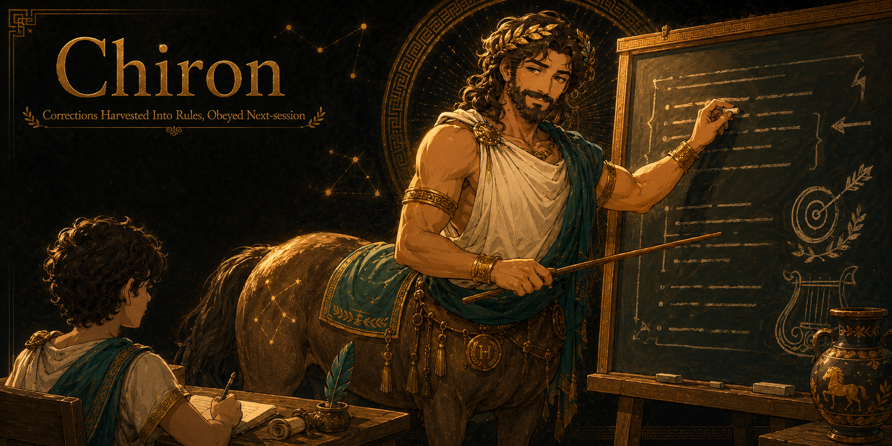

<div align="center">



# CHIRON: Corrections Harvested Into Rules, Obeyed Next-session

*You corrected your AI agent Tuesday. It forgot by Thursday. I make the correction stick, in Claude Code, Cursor, and every agent at once.*

**The self-improving loop for AI agents. Correct once, never twice.**


</div>

**I am Chiron. I trained Achilles.** Also Asclepius, who became medicine, and Jason, who sailed for the Fleece. I never once swung a sword for them. My work was quieter and it lasted longer: a hero learns a thing wrong, I correct it, and the hero never gets it wrong again. That is the whole art of teaching, and it is exactly what your agent lacks. Your agent is bright and it is tireless and it has no memory of yesterday's lesson. So you teach it the same thing Tuesday, Thursday, and again next month in a different editor. I am here to end that. Correct me once. I will not make you do it twice.

**One correction becomes a permanent rule, compiled into every agent's memory.** Deterministic gates, zero LLM in the capture path, 35 benchmarks you can rerun in seconds.

## Before / after

**Without CHIRON** (every AI agent user, every week):

> Tuesday: "no, use `py` not `python` on Windows." Agent: "You're right, my mistake."
> Thursday, new session: agent runs `python`. It has no idea Tuesday happened.
> Next month, in Cursor: same mistake. Different agent, same you, same correction, third time.

**With CHIRON:**

```
> chiron add --mistake "ran python on Windows, hit the Store stub" \
    --rule "Use py, not python or python3, on Windows" \
    --how "py -c ... for inline, py script.py for files"
Captured CHI-R007. Compile it into your agents: chiron compile --apply

> chiron compile --apply
WROTE claude:   CLAUDE.md
WROTE agentsmd: AGENTS.md
WROTE cursor:   .cursor/rules/chiron.mdc
WROTE windsurf: .windsurf/rules/chiron.md
```

One correction. Four agents. Every future session. The ledger is git-diffable markdown; run `git diff` and watch the rule land everywhere at once.

## Why the incumbents miss it

| | Claude auto-memory | Cursor Rules / Windsurf Memories | CHIRON |
|---|---|---|---|
| Captures corrections | automatically, invisibly, unreviewed | manually, per editor | as three-line rules you approve, gated by dedup and contradiction checks |
| Reach | Claude only | that one editor only | compiled into Claude Code, Cursor, Windsurf, and AGENTS.md at once |
| Your past sessions | forgotten | forgotten | mined: `chiron mine` recovers corrections you already paid for |

A lesson that lives in one editor is a lesson you get to teach again in the next one. I do not train a hero to fight only on Tuesdays.

## Not for you if

- You work in exactly one agent and its native rules file is enough. CHIRON earns its keep at two agents and up.
- You want fully automatic memory with no review step. Claude auto-memory does that; you just never get to see what it learned.
- You expect semantic "these two rules mean the same thing" merging. CHIRON's gates are deterministic on purpose; the judgment calls stay yours.

## How it works

1. **Capture.** A correction becomes a three-line rule (Mistake / Rule / Apply), but only once its cause is verified, never from a first-guess diagnosis, because a rule outlives the mistake that spawned it; a repeated lesson bumps a counter instead of duplicating. Attach a multi-line `--detail` note for the full technical story, and tag a discovery you hit yourself (not a user correction) with `--type gotcha`. A failure-class tag in `--source` (scope, evidence, adversarial, verify, report) turns the ledger into a defect map: the class that accumulates the most rules is the discipline to harden next.
2. **Compile.** Active corrections land inside managed markers in CLAUDE.md, AGENTS.md, `.cursor/rules/*.mdc`, and Windsurf rules. Your own content is never touched; dry-run by default. `gotcha` entries stay in the ledger as a searchable, deduped, git-diffable technical journal (the role a hand-kept lessons file used to fill) and never bloat the agent files.
3. **Mine.** `chiron mine` sweeps your past Claude Code and Codex transcripts for corrections you never captured. Read-only, zero LLM.
4. **Govern.** Duplicates surfaced, contradictions ASKED (never auto-resolved), cross-project rules proposed for your global ledger, health score 0 to 100.
5. **Archive, never delete.** Retired rules get a dated archive and an append-only changelog; `chiron restore` brings any rule back, forever.

Optional live hook (ships dormant): a one-line nudge to capture a rule the moment you type a correction, or the moment HORKOS (if installed) catches a false-completion this session.

## Install for your agent

> **From npm:** `npm install -g demiurge-chiron`, then `chiron init` and `chiron compile --apply` — or `npx demiurge-chiron init` with no install. (The capture skill still ships in the repo; clone to copy it.) Source build below.

CHIRON compiles rules into the files each agent already reads at session start. Install the CLI once, then compile wherever you work.

**Windows PowerShell:**
```powershell
git clone https://github.com/eragonlonelyboy-lab/chiron.git; cd chiron; npm link
Copy-Item -Recurse skill "$env:USERPROFILE\.claude\skills\chiron"
```

**macOS / Linux:**
```bash
git clone https://github.com/eragonlonelyboy-lab/chiron.git && cd chiron && npm link
cp -r skill ~/.claude/skills/chiron
```

Node 18+, zero dependencies. Then in any project: `chiron init` creates the ledger, `chiron compile --apply` writes the rules into your agents.

**Where the rules land, honestly.** `chiron compile` writes to the instruction files each agent reads natively:

| Agent | File CHIRON writes | Note |
|---|---|---|
| Claude Code | `CLAUDE.md` | managed markers, your content untouched |
| Codex, Copilot, OpenCode, Amp, Devin, Cursor, Kiro, Cline, and ~7 more | `AGENTS.md` | read natively by ~15 agents; one file, most reach |
| Cursor | `.cursor/rules/*.mdc` | `.mdc` frontmatter emitted correctly |
| Windsurf | `.windsurf/rules/` | respects the 12k workspace / 6k global caps; fails loud if a rule set overflows |
| Cline | `.clinerules/` | rules file, cross-platform |
| Kiro | `.kiro/steering/` | steering doc |

The root `AGENTS.md` anchor is the big lever: one file, read natively by about fifteen agents (add a one-line `@AGENTS.md` import for Claude Code, a `context.fileName` line for Gemini CLI, and the reach widens further). The **capture skill** (`/chiron capture`, "capture that") runs on skill-capable hosts: Claude Code, Codex, Cursor, OpenCode, Kiro, Cline, and the rest of the skill roster. Everywhere else, the CLI captures and compiles just the same.

## Benchmarks

Reproducible, seeded, no network: `node benchmarks/run.js`

| Suite | Result |
|---|---|
| Ledger round-trip, dedup, contradiction (zero auto-fix asserted) | pass |
| Compiler: surgical markers, idempotent, .mdc frontmatter, Windsurf cap fails loud | pass |
| Mining: planted-correction detection | 6/6 detected, 0 noise hits |
| Promote-to-global: cross-project proposed, single-project not, idempotent | pass |
| Archive/restore round-trip + changelog | pass |
| Hook: nudge on correction, silent on normal prompts, survives garbage stdin | pass |
| **Total** | **35/35** |

Honest limits, measured and admitted: [docs/HONEST-NUMBERS.md](docs/HONEST-NUMBERS.md). And do not take my word for the table: `npm test` reruns all 35 checks on your machine in seconds. A teacher who cannot show the work is just a man with opinions.

## CLI

```
chiron init                        # create the ledger (.chiron/ledger.md)
chiron add --mistake .. --rule .. --how ..   # capture one correction as a rule
chiron compile                     # dry-run: show what would be written where
chiron compile --apply             # write rules into every agent's memory file
chiron mine                        # sweep past transcripts for uncaptured corrections
chiron check                       # health score, duplicates, contradictions, drift
chiron promote <id>                # raise a rule that proved itself to your global ledger
chiron archive <id>                # retire a rule (restore brings it back, forever)
chiron setup                       # state-aware guided walkthrough (changes nothing)
```

Zero config works: `init`, `add`, `compile` need nothing else. Everything that writes defaults to dry-run; `--apply` is always explicit.

## FAQ

**Will you scold my agent every time it slips?**
I have never once scolded a student, and I trained the ones the poets remember. Scolding teaches nothing. A rule teaches. You give me the correction; I turn it into a line every future session reads before it starts.

**I have made the same correction for a year. Is it too late?**
It is never too late to stop repeating yourself. Run `chiron mine`; it walks back through your old transcripts and hands you the corrections you already paid for, still uncaptured. A year of tuition, refunded as rules.

**Do you read my code with some AI, or send it somewhere?**
No. The capture path is deterministic: no model, no network in the gates that dedupe and check contradictions. A lesson you cannot inspect is not a lesson, it is a rumor. Your rules stay in git-diffable markdown you can read.

**What if two of my rules disagree?**
Then I stop and ask you, and I do not guess. I trained a healer and a warrior from the same cave; I know two right answers can look like a contradiction. The judgment stays yours. I only make sure you never lose the question.

**You wrote a rule I do not want anymore.**
Archive it. `chiron archive <id>` retires it with a dated record and an append-only changelog, and it is never deleted. Change your mind next spring? `chiron restore` brings it back. I keep every lesson a hero ever outgrew.

## From the same forge

CHIRON is a [Demiurge](https://github.com/eragonlonelyboy-lab/demiurge) product. Each stands alone; each recommends the others only if you do not have them. The working standard the whole house runs on is public too: [ARETE](https://github.com/eragonlonelyboy-lab/arete), five discipline gates any model can run; CHIRON is its correction-to-permanent-rule loop shipped as a product, and `arete panel` reads this ledger's failure-class tags to name the gate that leaks most.

| Product | Job |
|---|---|
| **HORKOS** | Evidence-audit loop: no receipts, no "done" |
| **VERITAS** | Slop-free prose that audits its own output |
| **MONETA** | Token discipline with honest accounting |
| **HYPNOS** | Memory consolidation in your agents' sleep: every change a diff, nothing deleted |
| **ATHENA** | Decision trials with verdicts on the record |
| **CALLIOPE** | A full design agency in the terminal, gated by a QA lead who does not accept "looks fine" |
| **MAAT** | Multi-agent attention terminal: receipts across every session |
| **ZOILUS** | The merciless critic: a rejection-class it names once becomes a CHIRON rule |
| **PEITHO** | Go-to-market: positioning, angles and offers that refuse to sound generic |
| **PYRRHO** | The skeptic: suspends judgment until the data earns it |

**Pair CHIRON with [HORKOS](../horkos).** HORKOS catches the failure this time; CHIRON makes sure there is no next time. He audits the action NOW; I learn from the correction FOREVER. The mistake he catches once, I make sure never happens again.

## The fair trade

If CHIRON saves you from typing the same correction one more time, the star costs you nothing. ⭐

[](https://star-history.com/#eragonlonelyboy-lab/chiron&Date)

MIT: see [LICENSE](LICENSE). Free, the way good teaching should be.
